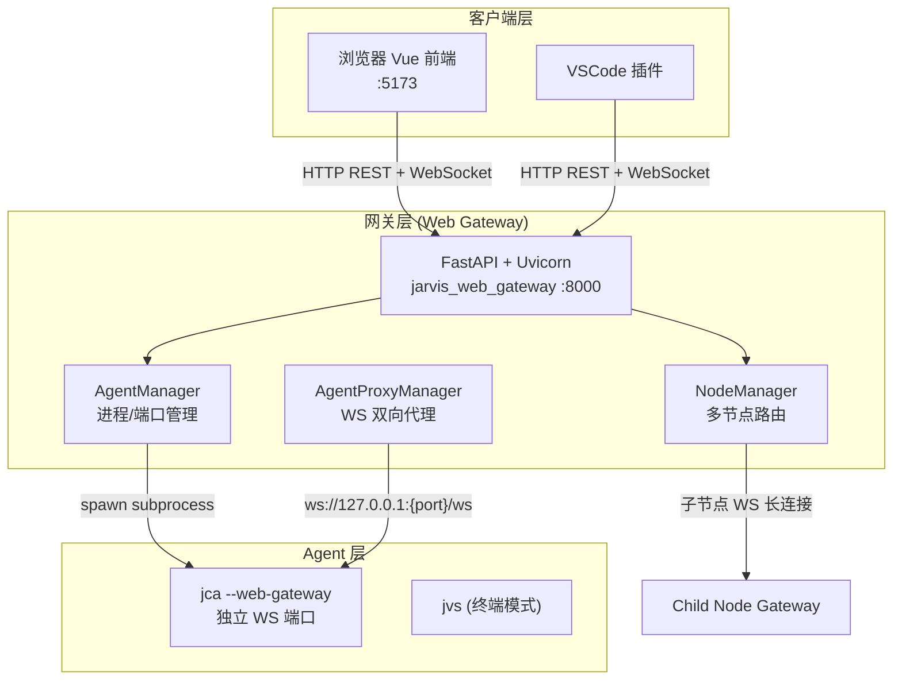
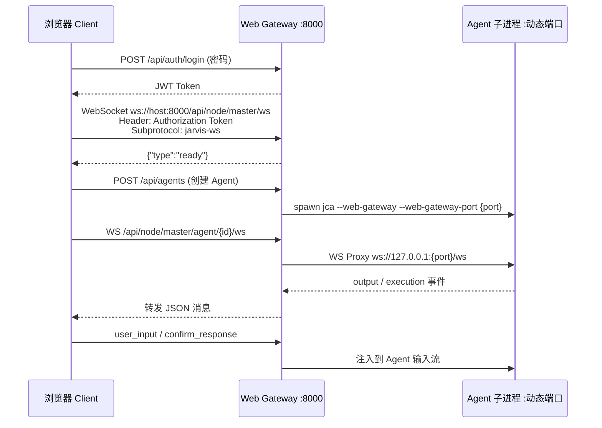

# Jarvis Web 架构：依赖、启动与 WebSocket 远程访问指南

Jarvis 的 Web 体系是**前后端分离 + 网关桥接**的三层架构，不是 `jvs` 终端命令自带的网页模式。本文档汇总 Web Server、Web Client 的依赖信息、启动与使用方式，以及通过 WebSocket 实现远程访问的原理。

---

## 一、整体架构



| 组件 | 源码位置 | 默认端口 | CLI 命令 |
|------|----------|----------|----------|
| **前端 Client** | `src/jarvis/jarvis_service/frontend/` | `5173` | 由 `jarvis-service` 启动 |
| **Web Gateway Server** | `src/jarvis/jarvis_web_gateway/` | `8000` | `jwg` / `jarvis-web-gateway` |
| **服务编排器** | `src/jarvis/jarvis_service/` | — | `jarvis-service` / `jservice` |
| **网关抽象层** | `src/jarvis/jarvis_gateway/` | — | 库模块，无独立命令 |
| **Agent 进程** | `jca` / `jvs` | 动态分配 | 由 Gateway 拉起 |

---

## 二、依赖信息

### 2.1 Server 端（Python）

安装 Jarvis 后，Web 相关能力随主包一并安装（`pip install -e .` 或 `uv tool install`）。

**核心 Python 依赖**（来自 `pyproject.toml`）：

| 依赖 | 版本 | 用途 |
|------|------|------|
| `fastapi` | 0.115.12 | REST API + WebSocket 端点 |
| `uvicorn[standard]` | 0.33.0 | ASGI HTTP/WS 服务器 |
| `websockets` | — | Agent WS 代理、子节点通信 |
| `httpx` | — | HTTP 代理、节点间请求 |
| `aiohttp` | ≥3.9.0 | 异步 HTTP |
| `typer` | — | CLI（`jwg`、`jarvis-service`） |
| `pyyaml` | ≥5.3.1 | 配置读写 |
| `psutil` | ≥5.9.0 | 进程监控 |

**Server 模块职责**：

- `jarvis_web_gateway`：网关主服务（Agent 管理、认证、WS 路由、文件/终端 API）
- `jarvis_gateway`：统一 I/O 抽象（`GatewayOutputEvent`、`GatewayInputRequest` 等事件模型）
- `jarvis_service`：编排器，同时拉起 Gateway + 前端

**Server 运行时额外要求**：

- Python **3.12**
- 已配置 LLM（`~/.jarvis/config.yaml`）
- 创建 Agent 时需在目标机器上可执行 `jca` / `jvs`

### 2.2 Client 端（前端）

**源码**：`src/jarvis/jarvis_service/frontend/`  
**构建工具**：Vite 5 + Vue 3

**生产依赖**（`package.json`）：

| 包 | 用途 |
|----|------|
| `vue` ^3.4 | UI 框架 |
| `vite` ^5.2 | 构建/开发服务器 |
| `@vitejs/plugin-vue` | Vue SFC 支持 |
| `monaco-editor` | 在线代码编辑器 |
| `xterm` + `@xterm/addon-fit` | 终端面板 |
| `marked` + `highlight.js` | Markdown 渲染 |
| `mermaid` / `d3-graphviz` / `plantuml-encoder` | 图表渲染 |

**Client 运行时要求**：

- **Node.js** + **npm**（`jarvis-service run` 会自动 `npm install` 和 `npm run build`）
- 现代浏览器（支持 WebSocket、`localStorage`）

---

## 三、启动与使用

### 3.1 推荐：一键启动（Gateway + 前端）

```bash
# 在项目目录或任意目录均可（需已安装 Jarvis）
jarvis-service run
# 或
jservice run
```

**默认监听**：

| 服务 | 地址 |
|------|------|
| Web Gateway | `http://127.0.0.1:8000` |
| 前端网页 | `http://127.0.0.1:5173` |

**常用参数**：

```bash
# 自定义端口
jarvis-service run --gateway-port 9000 --frontend-port 5174

# 设置网关密码
jarvis-service run --gateway-password "your_password"

# 允许局域网/远程访问 Gateway
jarvis-service run --gateway-host 0.0.0.0

# 前端开发模式（热加载）
jarvis-service run --dev
```

**浏览器使用步骤**：

1. 打开 **http://127.0.0.1:5173**
2. 在连接弹窗填写网关地址：`127.0.0.1:8000`
3. 有密码则填写，点击「连接」
4. 连接成功后创建 Agent、发消息、使用终端/编辑器等

> **注意**：启动服务的终端需保持运行；关闭后 5173/8000 会不可用。

### 3.2 仅启动 Gateway（不含前端）

```bash
jwg                          # 默认 127.0.0.1:8000
jwg --host 0.0.0.0 --port 8000 --gateway-password "pwd"
```

此时需自行提供前端，或手动构建并预览：

```bash
cd src/jarvis/jarvis_service/frontend
npm install && npm run build && npm run preview -- --host 127.0.0.1 --port 5173
```

### 3.3 Agent 内嵌 Gateway 模式

代码代理可随进程附带 Gateway（供 Web 管理单个 Agent）：

```bash
jca --web-gateway
jca --web-gateway --web-gateway-port 8001 --gateway-password "pwd"
```

> 当前版本中 **`jvs` 不支持 `--web-gateway`**，Web 界面创建「通用 Agent」可能失败；创建「代码 Agent」（`jca`）更可靠。

### 3.4 后台服务（Linux systemd）

```bash
jarvis-service install --gateway-host 0.0.0.0 --gateway-password "pwd"
jarvis-service start master
systemctl --user status jarvis-master.service
```

---

## 四、WebSocket 远程访问原理

### 4.1 为什么用 WebSocket

Jarvis Agent 本质是**长时间运行、双向交互**的进程：

- **输出**：日志、Markdown、工具执行结果、终端流
- **输入**：多行任务、确认对话框、交互式终端 keystroke

HTTP 请求-响应不适合这种持续流式交互，因此采用 **WebSocket 长连接** 作为实时通道；管理类操作（Agent CRUD、文件读写、配置）仍走 **HTTP REST**。

### 4.2 连接建立流程



**前端连接逻辑**（`App.vue`）：

1. 解析网关地址（支持 `127.0.0.1:8000` 或 `ws://host:port/ws`）
2. `POST /api/auth/login` 换取 Token（可存 `localStorage`）
3. 建立主连接：`ws://{host}:{port}/api/node/master/ws`，子协议 `jarvis-ws`
4. 选中 Agent 后，再建 Agent 级连接：`/api/node/master/agent/{agent_id}/ws`

### 4.3 消息协议（核心类型）

Gateway 与 Client 之间 JSON 消息：

| type | 方向 | 含义 |
|------|------|------|
| `ready` | G→C | 连接就绪 |
| `output` | G→C | Agent 输出（text、output_type、context） |
| `input_request` | G→C | Agent 等待用户输入 |
| `confirm` | G→C | 确认对话框 |
| `execution` | G→C | 命令执行/终端事件 |
| `user_input` | C→G | 用户提交输入 |
| `confirm_response` | C→G | 确认结果 |

Agent 侧通过 `jarvis_gateway` 桥接：

- **输出**：`WebGateway.emit_output()` → `SessionOutputRouter.publish()` → WebSocket 推送
- **输入**：`WebGateway.request_input()` → 发 `input_request` → 阻塞等待 Client 回传 → `RemoteInputSession.wait_for_input()`
- **终端**：`TerminalSessionManager` 将 PTY 输出发布到 WebSocket

### 4.4 Agent 级 WebSocket 代理

`AgentProxyManager` 负责 Gateway 到 Agent 的双向转发：

```
agent_url = f"ws://127.0.0.1:{port}/ws"
```

（源码：`src/jarvis/jarvis_web_gateway/agent_proxy_manager.py`）

- Gateway 对外暴露统一 URL
- 内部连接到 Agent 本机动态端口
- Client 无需知道 Agent 实际端口

### 4.5 远程访问如何实现

**本机访问**（默认）：

- Gateway：`127.0.0.1:8000`
- Frontend：`127.0.0.1:5173`
- 仅本机可连

**局域网/跨机器访问**：

```bash
# 1. Gateway 监听所有网卡
jarvis-service run --gateway-host 0.0.0.0 --gateway-port 8000 --gateway-password "pwd"

# 2. 前端也需可达（或单独部署静态页）
jarvis-service run --frontend-host 0.0.0.0 --frontend-port 5173
```

远程浏览器：

1. 打开 `http://<服务器IP>:5173`
2. 网关地址填 `<服务器IP>:8000`
3. 输入密码连接

**安全机制**：

- 密码登录 → JWT Token（`POST /api/auth/login`）
- 后续 HTTP/WS 请求带 Token 校验
- 可选「连接锁定」：同一 session 只允许一个 WS 连接

**HTTPS/WSS**：

- 前端在 HTTPS 页面会自动优先使用 `wss://`
- 生产环境建议在 Gateway 前加 **Nginx/Caddy** 做 TLS 终结

### 4.6 多节点远程访问（分布式）

适用于多机 Agent 池、异地协作：

```bash
# 主节点（统一入口）
jarvis-service run --node-mode master --gateway-host 0.0.0.0 --gateway-password pwd

# 子节点（接入主节点）
jarvis-service run --node-mode child \
  --node-id worker-01 \
  --master-url ws://master-ip:8000 \
  --node-secret $(cat ~/.jarvis/node_mode/master_node_secret)
```

**原理**：

- 子节点通过 WebSocket 长连接注册到主节点（`/ws/node`）
- Client 只连主节点
- 主节点按 Agent 所属 `node_id` 转发 HTTP/WS 到对应子节点
- 创建 Agent 时可指定目标节点

更多细节见：[分布式网关部署方法](./分布式网关部署方法.md)

---

## 五、关键 API / WebSocket 端点

| 类型 | 路径 | 说明 |
|------|------|------|
| WS | `/api/node/master/ws` | 主 Gateway 连接（前端默认） |
| WS | `/api/node/{node_id}/agent/{agent_id}/ws` | Agent 级实时通道 |
| WS | `/ws/node` | 子节点注册（master 模式） |
| HTTP | `POST /api/auth/login` | 密码登录 |
| HTTP | `GET/POST /api/agents` | Agent 管理 |
| HTTP | `GET /api/node/master/agents` | 节点代理 REST |

---

## 六、常见问题

| 问题 | 原因 | 处理 |
|------|------|------|
| `ERR_CONNECTION_REFUSED :5173` | 前端未启动 | 运行 `jarvis-service run` |
| 连接成功但创建 Agent 失败 | `jvs` 不支持 `--web-gateway` | 创建「代码 Agent」或修复 `jvs` CLI |
| 远程连不上 | Gateway 只监听 `127.0.0.1` | 加 `--gateway-host 0.0.0.0`，检查防火墙 |
| 首次启动慢 | 需 `npm install` + `vite build` | 等待终端出现 Frontend 地址后再访问 |

---

## 七、快速参考

```bash
# 本地完整 Web 体验
jarvis-service run
# 浏览器 → http://127.0.0.1:5173
# 网关地址 → 127.0.0.1:8000

# 远程 Gateway
jarvis-service run --gateway-host 0.0.0.0 --gateway-password "secret"

# 仅 Gateway
jwg --host 0.0.0.0 --port 8000
```

---

## 相关文档

- [启动 Web Gateway 服务](./启动_Web_Gateway_服务.md)
- [在浏览器中连接 Jarvis Gateway](./在浏览器中连接_Jarvis_Gateway.md)
- [使用密码登录 Web Gateway](./使用密码登录_Web_Gateway.md)
- [分布式网关部署方法](./分布式网关部署方法.md)
- [Web 界面与网关功能索引](./00_功能索引与映射说明.md)
