# Jarvis Web Gateway 问题笔记

> 记录时间：2026-06-10  
> 首问：「浏览器 → http://127.0.0.1:5173」和「网关 → 127.0.0.1:8000」分别是什么意思？网关的作用是什么？


## 阅读导航

> 本文按 **从浅到深** 组织：先懂 5173/8000 架构，再理解远程 Gateway 与分布式节点，最后是本机 child 实践与故障排查。  
> 重读时可按下方表格顺序浏览；各题保留 **原编号** 便于对照历史对话。

| 新编号 | 原编号 | 主题 |
|--------|--------|------|
| — | 开篇 | 5173 vs 8000、Gateway 作用、数据流 |
| Q2 | 原 Q5 | 浏览器、Gateway 与多 Agent / 多节点 |
| Q3 | 原 Q6 | 远程 Gateway 地址与访问方式 |
| Q4 | 原 Q7 | 远程使用方式的理解 |
| Q5 | 原 Q9 | 为什么 jvs-ai.cn:8000 就是网关 |
| Q6 | 原 Q11 | 从最开始的使用顺序（:9000） |
| Q7 | 原 Q12 | 未 child 接入时能否创建 Agent |
| Q8 | 原 Q10 | 子节点 child 启动参数 |
| Q9 | 原 Q8 | 目标节点与代理节点 |
| Q10 | 原 Q13 | child 是否必须常驻 / 开机自启 |
| Q11 | 原 Q14 | 本机 child 配置（lht-home-windos） |
| Q12 | 原 Q15 | 创建 Agent「未知错误」 |
| Q13 | 原 Q16 | 修复 jvs --web-gateway 支持 |
| Q14 | 原 Q17 | 选择目录「未知错误」 |

### 推荐阅读路径

```text
第一部分（基础）→ Q2（概念）→ Q3-Q5（远程入门）→ Q6-Q7（怎么用）
    → Q8-Q9（分布式）→ Q10-Q11（本机 child）→ Q12-Q14（排错）
```

---

## 第一部分：基础架构 — 5173 与 8000

> 原「开篇」内容：理解前端与 Gateway 的分工，是后续一切问题的基础。


## 两句话分别是什么意思

### `浏览器 → http://127.0.0.1:5173`

这是 **网页界面（前端 Client）** 的地址。

- 你在浏览器里打开的就是它
- 负责：页面、按钮、聊天区、Agent 列表、终端面板、编辑器等 **UI 展示**
- 由 `jarvis-service` 启动的 **Vue + Vite 前端** 提供
- **5173** 是前端默认端口

可以把它理解成：**Jarvis 的「网页壳子」**。

---

### `网关 → 127.0.0.1:8000`

这是 **Web Gateway（后端网关）** 的地址。

- 你在连接弹窗里填的「网关地址」就是它（`127.0.0.1:8000`）
- 负责：**真正的业务逻辑和与 Agent 的通信**
- 由 `jwg` / `jarvis_web_gateway`（FastAPI + Uvicorn）提供
- **8000** 是 Gateway 默认端口

可以把它理解成：**Jarvis 的「后台总机」**。

---

## 为什么要有两个地址？

因为架构是 **前后端分离**：

```
浏览器打开 5173（看界面）
       ↓ 连接
Gateway 8000（干活：认证、管 Agent、转发消息）
       ↓
Agent 子进程（jca/jvs，真正跑 AI 任务）
```

- **5173 只负责「显示和操作界面」**，本身不跑 Agent
- **8000 才是核心**：前端所有重要操作都要通过它

---

## 网关（8000）具体做什么？

| 作用 | 说明 |
|------|------|
| **认证** | 密码登录、发 Token，控制谁能连 |
| **Agent 管理** | 创建、停止、列出、复制 Agent |
| **WebSocket 中枢** | 把 Agent 的输出实时推给浏览器；把你在网页里的输入转给 Agent |
| **WS 代理** | 浏览器不直连 Agent，Gateway 代理到本机 Agent 的动态端口 |
| **HTTP API** | 文件读写、目录列表、配置、会话恢复等 |
| **终端桥接** | 网页里的 xterm 终端 ↔ 后端 PTY |
| **多节点路由**（可选） | 分布式时，把请求转发到远程子节点 |

一句话：**Gateway 是浏览器和 Agent 之间的「中间层 / 调度中心」**。

---

## 实际使用时你会看到什么

1. 浏览器访问 **http://127.0.0.1:5173** → 看到 Jarvis 网页
2. 弹出「连接到 Jarvis」→ 填 **127.0.0.1:8000** → 点连接
3. 连接成功后，网页通过 Gateway 去：
   - 拉 Agent 列表
   - 创建 Agent
   - 收发消息、终端输出等

---

## 第一次打开网页时，数据怎么走

下面用两张图说明：**你第一次打开 Jarvis 网页、点「连接」之后，数据在各组件之间如何流动**。

### 图 1：用户视角（先发生什么）

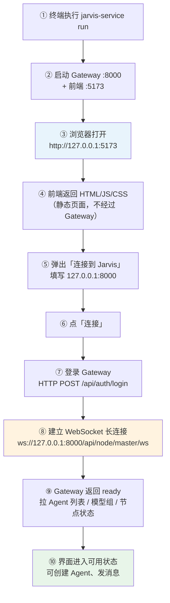

**要点**：

- **5173** 只在步骤 ③④ 提供网页文件；页面加载完成后，业务数据不再走 5173
- **8000** 从步骤 ⑦ 开始承担所有业务通信（HTTP + WebSocket）

---

### 图 2：技术视角（连接阶段时序）

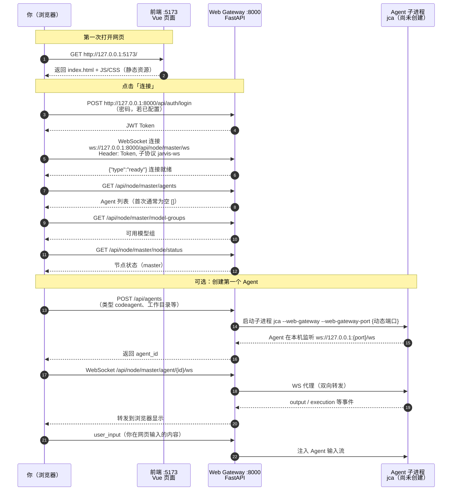

---

### 图 3：三个端口/角色一览

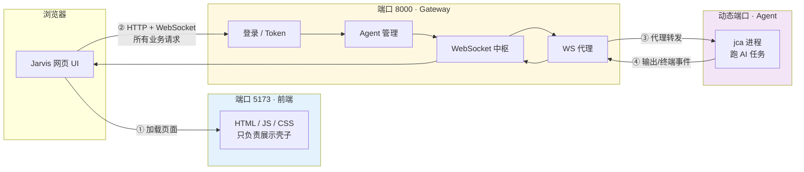

---

### 一句话记忆

| 步骤 | 谁 | 做什么 |
|------|-----|--------|
| 打开 5173 | 前端 | 给你看页面 |
| 连 8000 | Gateway | 认证 + 建 WebSocket + 管 Agent |
| 创建 Agent | Gateway → jca | 拉起子进程，分配动态端口 |
| 聊天/终端 | 浏览器 ↔ Gateway ↔ Agent | Gateway 做 WS 双向代理，浏览器不直连 Agent |

**常见情况**：

| 情况 | 结果 |
|------|------|
| 只开 5173、不开 8000 | 页面能打开，但连不上，无法使用 |
| 只开 8000、不开 5173 | 没有网页 UI（除非用 VSCode 插件等其它客户端直连 Gateway） |
| `jarvis-service run` | 两个一起启动，一般两个都要在跑 |

---

## 和纯终端 `jvs` 的对比

| 方式 | 结构 |
|------|------|
| **终端 `jvs`** | 你 ↔ 终端 ↔ Agent（一条线，无网页） |
| **Web 模式** | 你 ↔ 浏览器(5173) ↔ Gateway(8000) ↔ Agent（多一层网关） |

Gateway 的存在，是为了让 **浏览器、VSCode 插件、远程客户端** 都能用统一方式访问 Agent，而不必每个客户端自己管理 Agent 进程和端口。

---

## 补充：本机部署时是否必须启动 Gateway？

**没有公网域名 ≠ 没必要启动 Gateway。**

| 场景 | 是否需要启动 Web Gateway |
|------|--------------------------|
| 只用终端跑 `jvs` / `jca`，不用浏览器 | **不需要** |
| 本机浏览器打开 `http://127.0.0.1:5173` 使用 Web 界面 | **需要**（即使用户只有本机） |
| VSCode 插件连本机 Gateway | **需要** |
| 远程/公网访问 | **需要**，且还要 `0.0.0.0`、防火墙、域名/反代等 |

---

## 第二部分：核心概念

### Q2 · 2026-06-10

> 原编号：Q5

**问题**：也就是说浏览器只是一个 agent 使用的壳子，真正进行管理多个网络设备节点上的 agent 的是网关；这里说的多个网络设备节点可以代表同一个电脑上的多个 jvs agent 程序，或者多个不同网络下的电脑上运行的 jvs agent 程序？

**答复**：**大体正确**，但有两处需要区分清楚：

#### 1. 浏览器 = 壳子，Gateway = 调度中心 ✅

| 组件 | 角色 |
|------|------|
| **浏览器（:5173 前端）** | UI 壳子：展示、输入、点按钮 |
| **Gateway（:8000）** | 调度中心：认证、创建/停止 Agent、WebSocket 转发、跨节点路由 |

浏览器 **不直接** 管理 Agent 进程，一切通过 Gateway。

#### 2. 「多个 Agent」≠ 一定要「多个节点」

同一台电脑上跑 **多个 Agent**，**通常不需要** 开多个 node：

```
本机典型部署（单 master 节点）：

  浏览器 → Gateway(master) → Agent-1 (jca, 端口 8001)
                          → Agent-2 (jca, 端口 8002)
                          → Agent-3 (jca, 端口 8003)
```

Gateway 的 `AgentManager` 在同一台机器上拉起多个 Agent 子进程，每个分配独立端口，Gateway 统一代理。

#### 3. 「多个节点」= 多台机器（分布式）

**Node 模式（master / child）** 才对应「不同电脑 / 不同网络」：

```
                    浏览器 / VSCode 插件
                           │
                           ▼
              Gateway 主节点 (master) :8000
                     │         │
         ┌───────────┘         └───────────┐
         ▼                                 ▼
   本机 Agent                          子节点 child
   (master 上)                    (另一台电脑 :8000)
   Agent-A, Agent-B                 Agent-C, Agent-D
```

- **master**：统一入口，浏览器只连它
- **child**：另一台机器上的 Gateway，通过 WebSocket 长连注册到 master
- master 按 `node_id` 把请求转发到对应 child 上的 Agent

#### 4. 两种场景对照

| 场景 | 是否需要多节点 | 怎么做 |
|------|----------------|--------|
| 同一台电脑跑多个 Agent | **否** | 一个 `jarvis-service run`（master），Web 里多次「创建 Agent」 |
| 多台电脑各跑 Agent，统一入口 | **是** | 各机 `jarvis-service run --node-mode child`，浏览器连 master |
| 同一台电脑测多节点（少见） | 可以但不常见 | 本机起 master + child 两套 Gateway，一般仅联调 |

#### 5. 关于 jvs / jca

Web 界面创建的 Agent 类型：

- **代码 Agent（`jca`）**：Web 管理下最稳定，带 `--web-gateway`
- **通用 Agent（`jvs`）**：终端直接用；当前 Web 创建 `jvs` 可能因 CLI 参数不兼容而失败

因此说「多个 jvs agent」在概念上成立，但 Web 场景下实际多为 **多个 `jca` 子进程**。

#### 一句话总结

> **浏览器是壳，Gateway 是总管。**  
> 同机多 Agent → 一个 Gateway 管多个子进程即可；  
> 跨机多 Agent → master/child 多节点，Gateway 负责跨网络路由。

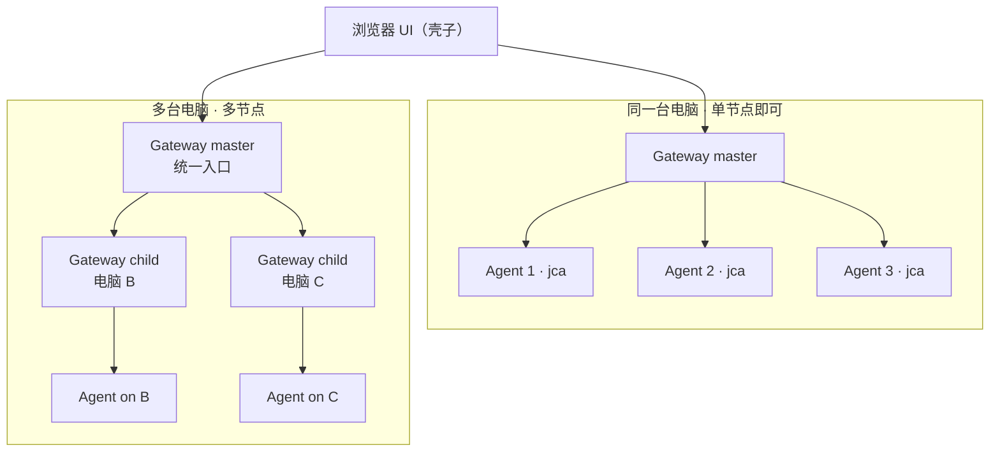

---

## 第三部分：远程 Gateway 入门

### Q3 · 2026-06-10

> 原编号：Q6

**问题**：请在 sky 的源码目录下查一查，部署在远程服务器上的 web gateway 地址是什么，如何访问，账户信息已经让管理员帮我创建了。

**答复**：在 `Jarvis_sky` 源码中检索到的远程部署信息如下（并已做连通性探测验证）。

#### 源码依据

| 文件 | 内容 |
|------|------|
| `test_full_proxy_chain.py` | `MASTER_URL = "http://jvs-ai.cn:8000"`（Master 节点） |
| `src/jarvis/jarvis_service/frontend/vite.config.js` | `allowedHosts: ['jarvis-front.tocmcc.cn', 'jvs-ai.cn']` |
| `docs/WEB_STARTUP.md` | 默认 Gateway `:8000`、前端 `:5173` |

#### 远程访问地址（当前可用）

| 服务 | 地址 | 探测结果 |
|------|------|----------|
| **Web 前端（浏览器打开）** | **http://jvs-ai.cn:5173** | HTTP 200 ✅ |
| **Web Gateway（连接弹窗填写）** | **jvs-ai.cn:8000** | HTTP 401 ✅（需登录，说明服务在运行） |

> `jarvis-front.tocmcc.cn` 在 vite 配置里出现过，但当前探测为 HTTP 404 / HTTPS 503，**暂不可用**；请优先使用 `jvs-ai.cn`。

#### 如何访问（管理员已创建账户）

1. 浏览器打开：**http://jvs-ai.cn:5173**
2. 弹出「连接到 Jarvis」窗口后：
   - **网关地址**：`jvs-ai.cn:8000`
   - **密码**：填写管理员为你创建的 Gateway 密码
3. 点击「连接」
4. 连接成功后即可创建 Agent、发消息、使用终端等

#### 连接流程示意

```
你的浏览器
    │
    ├─ ① 打开 http://jvs-ai.cn:5173        （前端 UI）
    │
    └─ ② 连接 jvs-ai.cn:8000 + 密码       （Gateway 认证）
            │
            └─ ③ 经 Gateway 管理远程/各节点上的 Agent
```

#### 注意事项

- 当前 **HTTPS 未通**（`https://jvs-ai.cn:8000` / `:5173` 连接失败），请使用 **HTTP** 及带端口地址
- Gateway 返回 **401** 表示需要密码；使用管理员提供的账户，**不要**留空
- 源码测试文件中的 Token 仅为开发测试用，**正常 Web 登录用管理员给的密码即可**
- 若连接失败，可自检：`curl http://jvs-ai.cn:8000/api/node/status`（未登录可能返回 401，属正常）
- 内网 IP（如记忆文件中的 `10.90.30.92:8000`）为内网调试地址，外网访问请用 **`jvs-ai.cn`**

---
### Q4 · 2026-06-10

> 原编号：Q7

**问题**：对于远程使用方式（打开 `http://jvs-ai.cn:5173`，连接 `jvs-ai.cn:8000` + 密码），`5173` 是网关的前端，通过这前端可以使用 `8000` 网关下管理的多个节点上的多个 jvs agent？

**答复**：**是的，理解正确。** 补充几点细节：

#### 你的理解 ✅

```
你（浏览器）
    │
    ▼
http://jvs-ai.cn:5173          ← 网关的「前端 UI 壳子」（只看 + 操作）
    │  填密码、连 Gateway
    ▼
jvs-ai.cn:8000                 ← 网关 master（总管、认证、路由）
    │
    ├── 本机 master 上的 Agent
    ├── child 节点 A 上的 Agent
    └── child 节点 B 上的 Agent
         ……
```

- **5173**：远程服务器上部署的 **Web 前端**，只负责界面
- **8000**：远程服务器上的 **Gateway master**，统一管理所有已接入节点及其 Agent
- 你 **只连一次** `jvs-ai.cn:8000`，即可在网页里看到并操作 **多个节点、多个 Agent**

#### 需要知道的细节

| 点 | 说明 |
|----|------|
| Agent 类型 | Web 里创建的多数是 **`jca`（代码 Agent）**；概念上都是 Agent 进程，不限于终端里的 `jvs` 命令 |
| 节点 | `jvs-ai.cn:8000` 是 **master**；其它机器上的 child 节点需先接入 master，你才会在网页里看到对应节点和 Agent |
| 你不需要记 Agent 端口 | Gateway 会代理到各 Agent 的动态端口，浏览器只和 8000 通信 |
| 创建 Agent 时 | 可在 Web 里选择 **目标节点**（若有多个 child 节点） |

#### 远程场景一句话

> 打开 **5173** 进网页壳 → 连 **8000** 登录 Gateway → 在 Gateway 管理的 **多节点、多 Agent** 上统一操作。

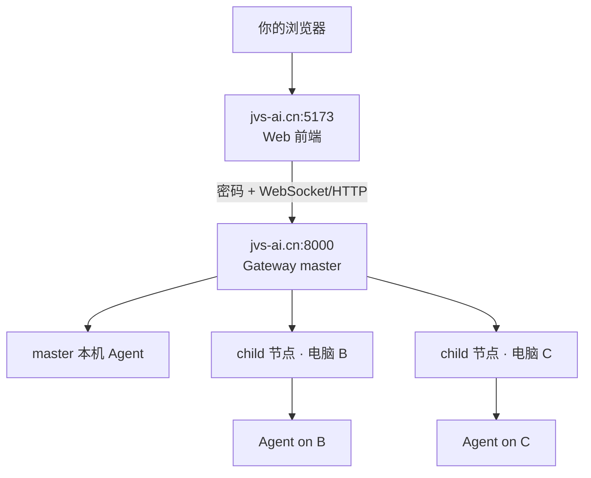

---
### Q5 · 2026-06-10

> 原编号：Q9

**问题**：`jvs-ai.cn:8000` 这个地址为什么就是网关？工作原理是什么？

**答复**：

#### 1. 为什么「这个地址」就是网关？

`jvs-ai.cn:8000` 并不是 Jarvis 写死的魔法地址，而是 **远程服务器上的部署约定**：

| 部分 | 含义 | 来源 |
|------|------|------|
| **`jvs-ai.cn`** | 远程 master 服务器的 **域名**（DNS 解析到该机器 IP） | 运维/管理员部署时配置 |
| **`:8000`** | Web Gateway 进程的 **默认监听端口** | Jarvis 代码默认 `--port 8000` |

源码默认值（`jarvis_web_gateway/cli.py`）：

```python
port: int = typer.Option(8000, "--port", "-p", help="监听端口")
```

远程服务器上通常类似这样启动：

```bash
jarvis-service run \
  --node-mode master \
  --gateway-host 0.0.0.0 \    # 监听所有网卡，外网可访问
  --gateway-port 8000 \
  --gateway-password "xxx"
```

因此：

- 域名 → 找到 **哪台机器**
- 8000 端口 → 找到机器上跑的 **`jwg` / Web Gateway 进程**
- 该进程就是 Gateway，所以 **`jvs-ai.cn:8000` = 远程 Gateway 入口**

Sky 源码中的佐证：`test_full_proxy_chain.py` 里 `MASTER_URL = "http://jvs-ai.cn:8000"`；实际探测该地址返回 **401**（需登录），说明 Gateway 服务确实在运行。

#### 2. 为什么 5173 不是网关？

| 端口 | 跑的是什么 | 角色 |
|------|------------|------|
| **5173** | Vite 前端（Vue 静态页 + JS） | 只提供网页 UI |
| **8000** | FastAPI + Uvicorn（`jarvis_web_gateway`） | 认证、Agent 管理、WebSocket、路由 |

前端 **5173 上没有** `/api/auth/login`、`/api/agents`、`/api/node/master/ws` 等 Gateway API。  
你在连接弹窗填 `jvs-ai.cn:8000`，就是告诉浏览器：**业务请求发到 8000 这台 Gateway**。

#### 3. Gateway 工作原理（简化）

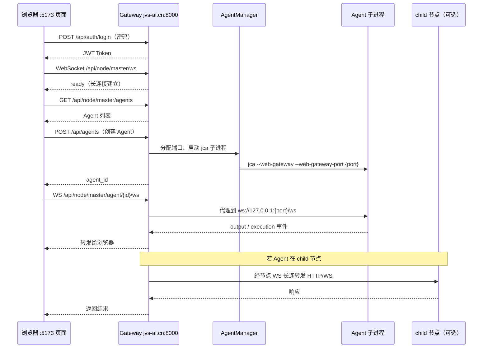

**Gateway 内部核心模块**：

| 模块 | 作用 |
|------|------|
| **认证（Token）** | 校验密码，发 Token，后续请求带 Token |
| **AgentManager** | 在本机或指定节点创建/停止 Agent 子进程 |
| **AgentProxyManager** | 把浏览器 WS 代理到 Agent 本机动态端口 |
| **NodeManager** | child 节点注册、跨节点 HTTP/WS 转发 |
| **WebGateway 桥接** | Agent 输出 → WebSocket；浏览器输入 → Agent |

#### 4. 和「普通网站」的区别

普通网站：`浏览器 → 一个 Web 服务器 → 返回页面`  
Jarvis Gateway：`浏览器 → Gateway → 管理/代理多个 Agent 进程（可能跨多台机器）`

Gateway **不只是网页服务器**，而是：

1. **进程管理器**（拉起/监控 Agent）
2. **WebSocket 中枢**（实时双向通信）
3. **跨节点路由器**（master 转发到 child）
4. **HTTP 代理**（可选，转发 LLM API 请求）

#### 5. 如何验证某个地址是不是 Gateway

```bash
# 未登录通常返回 401（说明 Gateway 在跑且要密码）
curl -i http://jvs-ai.cn:8000/api/node/status

# 登录后（需 Token）可拿到节点状态
# 前端则是 POST /api/auth/login → 拿 Token → 连 WebSocket
```

若 8000 端口没有跑 `jwg`，curl 会 **连接拒绝** 或超时，而不是 401。

#### 一句话

> **`jvs-ai.cn:8000` = 域名找到远程 master 机器 + 8000 端口上跑的 Jarvis Web Gateway 进程。**  
> 它是所有 Agent 和浏览器的 **统一入口与调度中心**；5173 只是连向它的 **网页客户端**。

---

## 第四部分：使用顺序与资源

### Q6 · 2026-06-10

> 原编号：Q11

**问题**：假如远程服务器网关是 `jvs-ai.cn:9000`，从最开始使用网关服务器以及本地 `jvs` CLI 的顺序应该是什么？

**答复**：分 **三种角色** 看顺序；端口改为 **9000** 时，凡提到 Gateway 的地方都用 **`jvs-ai.cn:9000`**（连接弹窗、`master-url` 等），前端一般仍是 **`http://jvs-ai.cn:5173`**（除非管理员改了前端端口）。

---

#### 场景 A：你只用浏览器访问远程 Gateway（最常见）

**不需要**在本机启动 Gateway，也 **不必**先跑本地 `jvs`。

| 步骤 | 谁做 | 做什么 |
|------|------|--------|
| ① | 管理员（已完成） | 远程执行：`jarvis-service run --node-mode master --gateway-host 0.0.0.0 --gateway-port 9000 --gateway-password "xxx"` |
| ② | 你 | 本机配置 LLM（若 Web 创建的 Agent 在远程跑，通常远程已配好；本地 CLI 才需要本地 `~/.jarvis/config.yaml`） |
| ③ | 你 | 浏览器打开：**http://jvs-ai.cn:5173** |
| ④ | 你 | 连接弹窗：**网关地址 `jvs-ai.cn:9000`** + 管理员给的密码 → 点「连接」 |
| ⑤ | 你 | 在 Web 里「创建 Agent」→ 选类型、工作目录、目标节点 → 开始对话 |

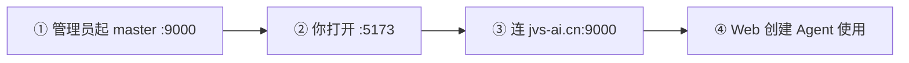

**本地 `jvs` 何时用？** 与远程 Gateway **无关**；想用终端时在本地另开终端执行 `jvs` / `jca` 即可，**两条独立路径**。

---

#### 场景 B：你的本机要作为子节点，接入远程 master

本机先以 **child** 接入，再在 Web 里把 Agent 创建到本机节点。

| 步骤 | 做什么 |
|------|--------|
| ① | 本机安装 Jarvis，配置 `~/.jarvis/config.yaml`（LLM 等） |
| ② | 向管理员拿到 **node-secret**（与 master 相同） |
| ③ | 本机启动 child Gateway（**不是** `jvs`）： |

```bash
jarvis-service run \
  --node-mode child \
  --node-id my-pc-01 \
  --master-url ws://jvs-ai.cn:9000 \
  --node-secret "管理员提供的密钥"
```

| 步骤 | 做什么 |
|------|--------|
| ④ | 保持上述终端运行（child 需常驻） |
| ⑤ | 浏览器打开 http://jvs-ai.cn:5173，连 **jvs-ai.cn:9000** + 密码 |
| ⑥ | 创建 Agent 时 **目标节点** 选 `my-pc-01` → Agent 在你本机跑 |
| ⑦ | （可选）另开终端本地 `jvs` / `jca`：与 Web 无关的独立会话 |

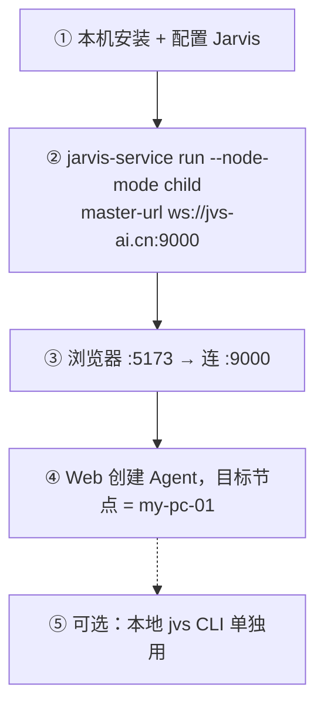

---

#### 场景 C：你既是管理员，又从零部署远程 + 自己使用

| 顺序 | 位置 | 命令 / 操作 |
|------|------|-------------|
| 1 | 远程服务器 | 安装 Jarvis，`jvs --quick-config` 或编辑 `~/.jarvis/config.yaml` |
| 2 | 远程服务器 | `jarvis-service run --node-mode master --gateway-host 0.0.0.0 --gateway-port 9000 --frontend-port 5173 --gateway-password "xxx"` |
| 3 | 远程服务器 | 记录 `cat ~/.jarvis/node_mode/master_node_secret`（给 child 用） |
| 4 | （可选）各子网机器 | child 启动，`--master-url ws://jvs-ai.cn:9000` |
| 5 | 你的电脑 | 浏览器 → http://jvs-ai.cn:5173 → 连 **jvs-ai.cn:9000** |
| 6 | 你的电脑 | Web 创建 Agent 使用 |
| 7 | 你的电脑（可选） | 本地 `jvs` / `jca`：纯终端，不依赖 Gateway |

---

#### 本地 `jvs` CLI 与远程 Gateway 的关系

| 用法 | 需要先连远程 Gateway？ | 本机要跑什么 |
|------|----------------------|--------------|
| 浏览器用远程 Agent | ✅ 连 `jvs-ai.cn:9000` | **不用**跑本地 Gateway / `jvs` |
| 本机终端 `jvs` | ❌ | 只跑 `jvs` 或 `jca` |
| 本机当 child，Web 在本机建 Agent | ✅ 浏览器连 master | 本机跑 **child Gateway**（不是 `jvs`） |
| 本机 Web + 本机 Gateway（不用远程） | ❌ | `jarvis-service run`（默认 8000，可改 9000） |

**顺序上没有「必须先 jvs 再连 Gateway」**；Web 路径与 CLI 路径可并行、互不依赖。

---

#### 端口 9000 注意点

| 项目 | 地址 |
|------|------|
| 浏览器打开（前端） | http://jvs-ai.cn:5173（默认，以管理员实际为准） |
| 连接弹窗（Gateway） | **jvs-ai.cn:9000** |
| child 的 master-url | **ws://jvs-ai.cn:9000** |
| 自检 Gateway | `curl -i http://jvs-ai.cn:9000/api/node/status` |

---

#### 推荐：普通用户最短路径

```text
1. 管理员已启动 master（:9000）并给你密码
2. 浏览器 → http://jvs-ai.cn:5173
3. 网关 → jvs-ai.cn:9000，填密码，连接
4. Web 里创建 Agent，开始使用
5. （可选）需要终端体验时，本地另开：jvs 或 jca
```

#### 推荐：本机当子节点最短路径

```text
1. 安装 Jarvis + 配置 LLM
2. jarvis-service run --node-mode child --node-id xxx --master-url ws://jvs-ai.cn:9000 --node-secret xxx
3. 浏览器连 master（:5173 → :9000）
4. 创建 Agent，目标节点选 xxx
5. （可选）本地 jvs CLI 独立使用
```

---
### Q7 · 2026-06-10

> 原编号：Q12

**问题**：管理员配置好网关后，若本机子节点没有 child 模式接入 master，Web 创建 Agent 是否无法成功？是否相当于整个网关下没有资源可用？

**答复**：**不完全是。** 没有 child 接入 **不等于** 整个 Gateway 无资源；**master 本身就是可用资源**。能否创建成功，取决于 **Agent 要创建在哪个节点上**。

#### 1. 核心结论

| 情况 | Web 能否创建 Agent |
|------|-------------------|
| 只连 master，**目标节点选 master（或不选，用默认）** | ✅ **可以**（Agent 跑在远程 master 服务器上） |
| **目标节点选你的本机**，但本机未 child 接入 | ❌ **不行**（节点不存在或 offline） |
| 选了某 child 节点，但该 child 未接入/已掉线 | ❌ **不行**（`NODE_NOT_FOUND` / `NODE_OFFLINE`） |
| master 本身未启动或密码错误 | ❌ **不行**（连不上 Gateway） |

> **没有 child ≠ 没有资源**；至少 **master 节点** 通常可用于创建 Agent。

#### 2. Gateway 下「资源」指什么

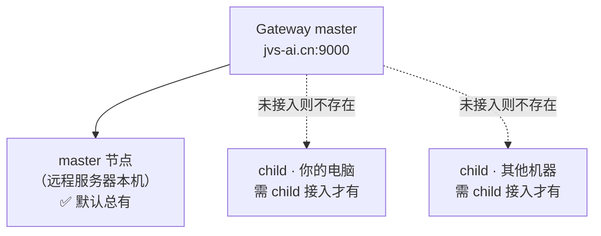

- **master**：随 `jarvis-service run --node-mode master` 启动，**始终是一个可用节点**
- **child**：每台子网机器需单独 `child` 接入后，才会出现在 Web 的「目标节点」列表里

#### 3. Web 创建 Agent 时的逻辑（源码）

创建时若 **未指定 node_id**，默认落在 **master 本机**：

```text
resolved_target_node = target_node_id or node_runtime.local_node_id  → 通常是 master
```

若指定了 **child 节点**：

- 节点未注册 → 报错 `NODE_NOT_FOUND`
- 节点已注册但 offline → 报错 `NODE_OFFLINE`
- 节点 online → 请求转发到该 child 创建 Agent

#### 4. 三种典型场景

**场景 A：你只用远程 master，本机不接入 child**

```text
✅ 可以：浏览器连 Gateway → 创建 Agent → 目标节点 master（默认）
→ Agent 在远程服务器上跑，工作目录填远程服务器上的路径
❌ 不能：目标节点选「你的电脑」（列表里没有或 offline）
```

**场景 B：你想让 Agent 在本机跑代码**

```text
必须先：本机 jarvis-service run --node-mode child ... 接入 master
再：Web 创建 Agent，目标节点选你的 node-id，工作目录填本机路径
```

**场景 C：管理员还部署了其他 child（同事机器）**

```text
✅ 可选他们的 online 节点
❌ 未接入的机器不会出现在列表，或选了也会失败
```

#### 5. 和「整个网关没有资源」的区别

| 理解 | 是否正确 |
|------|----------|
| 没有 child → 完全不能创建 Agent | ❌ 错误；master 上通常仍可创建 |
| 没有 child → 不能用 **本机** 当执行环境 | ✅ 正确 |
| Agent 列表为空 → 不能创建 | ❌ 错误；列表空只是还没有 Agent，**可以新建** |
| master 挂了 / 连不上 → 没有可用资源 | ✅ 正确 |

#### 6. 创建失败常见原因（与 child 无关的）

即使 master 正常、不选 child，仍可能失败：

| 原因 | 说明 |
|------|------|
| 工作目录不存在 | 在 master 上创建时，`working_dir` 必须是 **master 服务器上的路径** |
| Agent 类型 | Web 创建「通用 Agent（jvs）」可能因 CLI 不兼容失败；优先用 **代码 Agent（jca）** |
| LLM 未配置 | 远程 `~/.jarvis/config.yaml` 未配好 LLM |
| Gateway 未运行 | 8000/9000 连不上 |

#### 7. 如何确认 Gateway 下有哪些资源

连上 Gateway 后，在 Web 里可看：

- **节点状态 / 目标节点下拉框**：online 的 master + 已接入的 child
- 仅 **master (running)** → 只能把 Agent 建在远程服务器上
- 还有 **my-pc-01** 等 → 可选对应节点

命令行自检（需 Token 或登录后）：

```bash
curl http://jvs-ai.cn:9000/api/node/status   # 未登录可能 401
```

#### 一句话

> **未 child 接入只意味着「你的本机还不是 Gateway 下的一个节点」，不意味着 Gateway 整体无资源。**  
> 默认仍可在 **master** 上创建 Agent；只有当你 **指定本机或其它未接入机器** 为 target 时才会失败。

---

## 第五部分：分布式节点与创建 Agent

### Q8 · 2026-06-10

> 原编号：Q10

**问题**：远程 master 用 `jarvis-service run --node-mode master ...` 启动，那子网络节点上的 jvs 启动时，是不是也要指定对应的信息？

**答复**：**是的，子节点也要指定对应信息——但不是直接跑 `jvs`，而是跑 `jarvis-service run --node-mode child` 并接入 master。**

#### 1. 关键区分

| 启动方式 | 用途 | 是否接入 master |
|----------|------|-----------------|
| **`jarvis-service run --node-mode child`** | 子节点 Gateway，接入 master，供 Web 在该机器上创建 Agent | ✅ 必须 |
| **`jvs` / `jca` 终端直接用** | 本机终端交互 | ❌ 默认不接入 master |
| **Web 创建 Agent（目标节点选 child）** | master 通知 child 在该机拉起 Agent 子进程 | ✅ 前提：child 已接入 |

子节点要先以 **child Gateway** 身份连上 master；之后 Agent 通常由 **Web 界面经 master 创建**，而不是每台子机手动 `jvs`。

#### 2. Master 启动（远程服务器，已有）

```bash
jarvis-service run \
  --node-mode master \
  --gateway-host 0.0.0.0 \
  --gateway-port 8000 \
  --gateway-password "xxx"
```

首次启动后，节点密钥在：

```bash
cat ~/.jarvis/node_mode/master_node_secret
```

#### 3. Child 子节点启动（每台子网机器上）

以 `jvs-ai.cn` 为 master 的示例：

```bash
jarvis-service run \
  --node-mode child \
  --node-id worker-01 \
  --master-url ws://jvs-ai.cn:8000 \
  --node-secret "$(cat ~/.jarvis/node_mode/master_node_secret)"
```

| 参数 | 必填 | 说明 |
|------|------|------|
| `--node-mode child` | ✅ | 子节点模式 |
| `--node-id worker-01` | ✅ | 子节点唯一 ID（每台不同，如 worker-01、worker-02） |
| `--master-url ws://jvs-ai.cn:8000` | ✅ | master 的 WebSocket 地址（**不是** http://） |
| `--node-secret` | ✅ | 与 master **相同** 的节点密钥 |
| `--gateway-port` | 可选 | 本机 Gateway 端口，多台 child 同机时用不同端口 |
| `--gateway-password` | 一般不需要 | 浏览器登录密码是 **master** 的；child 用 node-secret 与 master 通信 |

多台 child 示例：

```bash
# 子节点 1
jarvis-service run --node-mode child --node-id worker-01 \
  --master-url ws://jvs-ai.cn:8000 --node-secret "与master相同"

# 子节点 2
jarvis-service run --node-mode child --node-id worker-02 \
  --master-url ws://jvs-ai.cn:8000 --node-secret "与master相同"
```

#### 4. Master vs Child 参数对照

| 项目 | Master（jvs-ai.cn） | Child（子网机器） |
|------|---------------------|-------------------|
| 模式 | `--node-mode master` | `--node-mode child` |
| 对外入口 | ✅ `0.0.0.0:8000` + 可选密码 | ❌ 不对外；只连 master |
| 前端 5173 | ✅ 通常启动 | ❌ child 模式**不启动**前端 |
| 浏览器连谁 | 连 master | 用户**只连 master**，不直连 child |
| 节点 ID | 默认 `master` | 自定义，如 `worker-01` |
| master-url | 不需要 | **必填** `ws://jvs-ai.cn:8000` |
| node-secret | 自动生成或指定 | **与 master 相同** |

#### 5. 接入后的工作流程

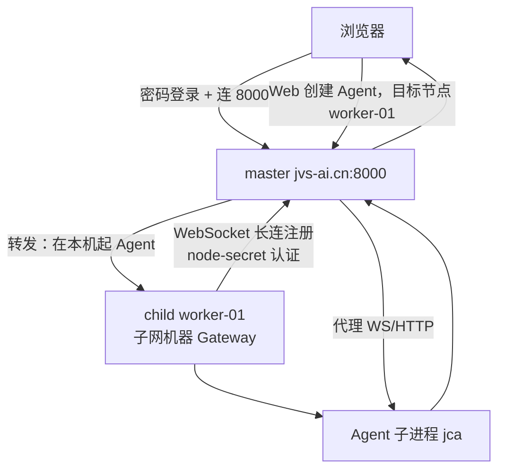

#### 6. 常见误区

| 误区 | 正确做法 |
|------|----------|
| 子机只跑 `jvs`，Web 就能看到 | 需先 `jarvis-service run --node-mode child` 接入 master |
| child 也要填 `--gateway-password` 给浏览器 | 浏览器密码只在 **master**；child 用 **node-secret** |
| `master-url` 写 `http://jvs-ai.cn:8000` | 应写 **`ws://jvs-ai.cn:8000`** |
| 每台 child 也要开 5173 给浏览器 | 浏览器只打开 **master 的 5173** |

#### 7. 网络要求

- 子节点机器必须能 **访问** `jvs-ai.cn:8000`（WebSocket 长连接）
- master 需能 **路由回** 子节点（经已建立的 WS 通道，child 不需公网 IP）
- 子节点需安装 Jarvis、配置好 LLM（`~/.jarvis/config.yaml`）

#### 一句话

> Master 用 `master` 模式对外服务；子网机器用 **`child` 模式 + node-id + master-url + node-secret** 接入 master。  
> Agent 由 Web 经 master 创建到指定 child，**不是**子机单独 `jvs` 就能被远程 Gateway 管理。

#### 相关文档

- [分布式网关部署方法](docs/用户手册/04_web_界面与网关/分布式网关部署方法.md)
- [Node 模式部署与联调手册](docs/用户手册/04_web_界面与网关/Node_模式部署与联调手册.md)

---
### Q9 · 2026-06-10

> 原编号：Q8

**问题**：创建 Agent 弹窗中「目标节点」和「代理节点（可选）」分别是什么意思？

**答复**：这两个字段解决的是**两个不同的问题**——Agent **在哪里运行**，以及 LLM 请求 **从哪条网络出去**。

#### 1. 目标节点 — Agent **在哪里运行**

**目标节点**决定这个 Agent 的进程实际跑在哪台机器（哪个 Jarvis 网关节点）上。

- 例如选择 `master (running)`：Agent 在**主节点**上启动并运行
- Agent 的日常操作都在该节点执行：读写工作目录、执行 shell 命令、代码分析、Git 操作等

在**分布式部署**（主节点 + 多个子节点）时，下拉框里会出现已接入的子节点，可把 Agent 创建到指定子节点，例如：

- 子节点上有特定代码仓库或开发环境
- 希望把计算任务分散到多台机器

**不选时**：使用默认节点（通常就是当前主节点）。复制 Agent 时会默认继承源 Agent 所在节点。

界面提示：*「未选择时使用默认节点；复制 Agent 时默认继承源节点。」*

#### 2. 代理节点 — LLM 请求 **从哪条网络出去**

**代理节点**决定 Agent 调用大模型（OpenAI、Claude 等）时，HTTP 请求走哪条路径。

| 选项 | 行为 |
|------|------|
| **无代理（直接调用）** | Agent 所在节点直接访问 LLM API |
| **指定代理节点** | LLM 请求先发到主节点 Gateway，再由指定节点代为转发到 LLM 服务商 |

底层会把 API 地址改写为类似：

```text
{master_url}/api/node/{proxy_node}/http_proxy/{原始LLM地址}
```

**典型使用场景**：

| 场景 | 说明 |
|------|------|
| 子节点无法访问外网 | Agent 在子节点跑，但 LLM 请求经 master 等有外网的节点转发 |
| 内网 LLM 服务 | 只有某台机器能访问内网模型 API，指定该节点作代理 |
| 统一出口 / 审计 | 所有 LLM 流量经固定节点出去 |

**不选时**：Agent 直接调用 LLM，不经过其他节点转发。

界面提示：*「指定后将通过代理节点转发 LLM 请求，留空则直接调用。」*

#### 3. 两者关系（可独立配置）

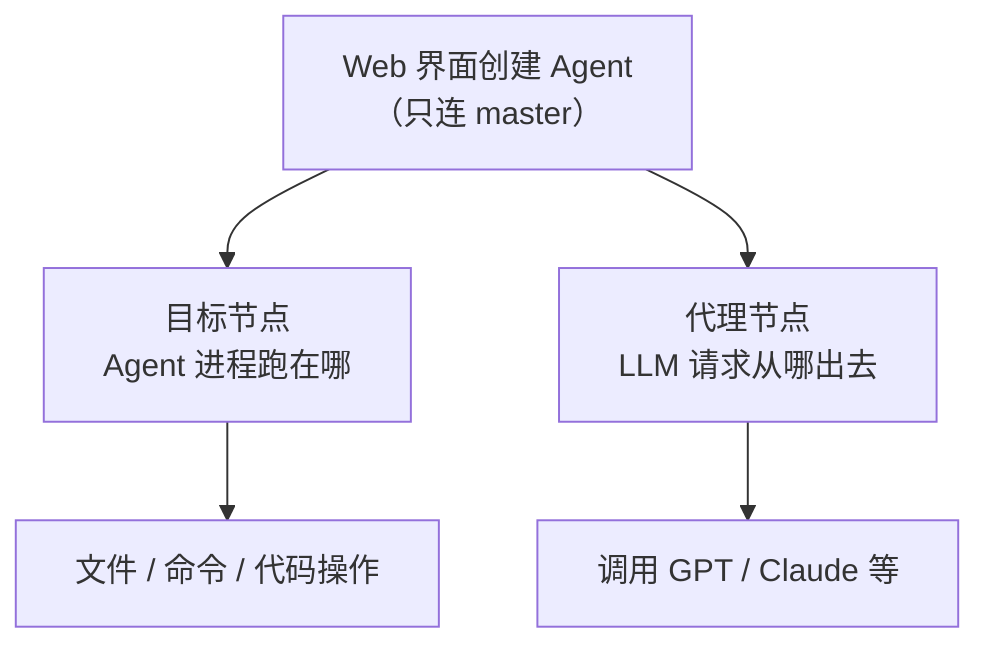

**举例**：

- **目标节点** = `worker-01`（代码在子节点上跑）
- **代理节点** = `master`（子节点出不了外网，LLM 请求经 master 转发）

#### 4. 单节点 vs 分布式

| 场景 | 目标节点 | 代理节点 | 说明 |
|------|----------|----------|------|
| 单节点（常见） | `master` | 无代理 | Agent 和 LLM 调用都在本机完成 |
| 跨机跑 Agent | 选 child 节点 | 按需 | Agent 在子节点干活 |
| 子节点无外网 | 选 child 节点 | 选 `master` | 任务在子节点，LLM 经 master 出网 |

#### 一句话记忆

> **目标节点** → Agent **在哪干活**（运行位置）  
> **代理节点** → 大模型 API **从哪条网络出去**（可选，解决网络隔离问题）

#### 相关文档

- [创建通用 Agent 或代码 Agent](docs/用户手册/04_web_界面与网关/创建通用_Agent_或代码_Agent.md)
- [分布式网关部署方法](docs/用户手册/04_web_界面与网关/分布式网关部署方法.md)

---

## 第六部分：本机 child 实践

### Q10 · 2026-06-10

> 原编号：Q13

**问题**：child 模式启动命令是否必须 **开机自动运行**，才支持在远程 Gateway 上对本机进行 Agent 创建和管理？

**答复**：**是的，本质上需要 child 进程长期在线**（不限于「开机自启」，但关机、关终端、进程退出后都无法在本机建/管 Agent）。**开机自启是最稳妥的做法。**

#### 1. 为什么必须常驻运行

child Gateway 与 master 之间是 **WebSocket 长连接**。远程 Web 要在你电脑上创建/管理 Agent，必须：

| 条件 | 说明 |
|------|------|
| child 进程在跑 | `jarvis-service run --node-mode child ...` 不能停 |
| 已连上 master | `master-url ws://jvs-ai.cn:9000` 通道正常 |
| 节点状态 online | Web「目标节点」里才会出现 `my-pc-01` 且可选 |

**一旦 child 停止**（关机、休眠、关终端、进程崩溃）：

- 本机在 master 侧变为 **offline**
- Web **无法**在本机新建 Agent（`NODE_OFFLINE`）
- 已有 Agent 的 WebSocket/终端/消息也会 **中断**

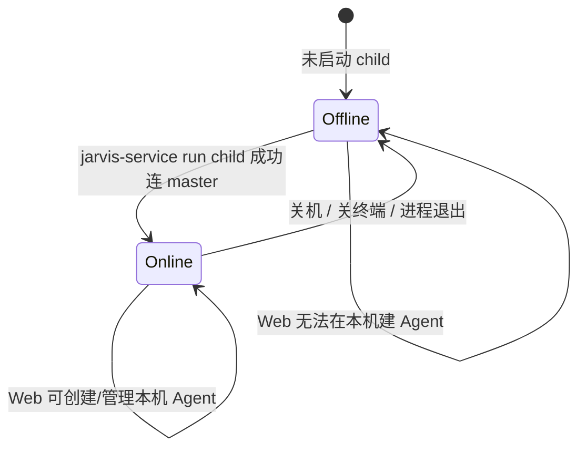

#### 2. 是否一定要「开机自动运行」

| 方式 | 能否支持远程建/管本机 Agent | 说明 |
|------|----------------------------|------|
| 手动开终端跑 child，**保持不关** | ✅ 可以 | 适合临时试用 |
| **开机/登录自启**（systemd / 计划任务） | ✅ 可以 | **生产环境推荐** |
| 只跑过一次，之后没开 | ❌ 不行 | 节点 offline |
| 电脑关机 | ❌ 不行 | 直到再次启动 child |

结论：**不是必须「开机自启」这一种形式，但必须「需要用时 child 就在线」**；开机自启是最省心的方式。

#### 3. 推荐：注册为系统服务（开机/登录自启）

**Linux（systemd 用户服务）** — 先安装再启动：

```bash
# 一次性安装（写入 systemd 单元，含 child 参数）
jarvis-service install \
  --node-mode child \
  --node-id my-pc-01 \
  --master-url ws://jvs-ai.cn:9000 \
  --node-secret "管理员提供的密钥" \
  --gateway-port 8000

# 启动并设为登录自启
jarvis-service start child
# 或
systemctl --user enable jarvis-child.service
systemctl --user start jarvis-child.service
```

**Windows** — 同样支持 `jarvis-service install`（计划任务，登录时启动）。

安装后 child 会 **后台常驻 + 断线自动重启**（`Restart=always`），比手动开终端可靠。

#### 4. 与「Agent 进程」的关系

| 进程 | 谁启动 | 是否要自启 |
|------|--------|------------|
| **child Gateway** | 你或 systemd | ✅ 建议自启（本机成为节点的条件） |
| **Agent（jca 子进程）** | Web 经 master 创建时拉起 | 一般 **不需要**单独自启；随 Web 创建/停止 |

child 是 **节点接入层**；Agent 是 **任务执行层**。  
自启 child ≠ 自启 Agent；但 **没有 online 的 child，Web 就无法在本机创建 Agent**。

#### 5. 使用流程小结

```text
1. （一次性）本机 jarvis-service install ... child 参数
2. （建议自启）jarvis-service start child 或 systemd enable
3. 浏览器连远程 master（:5173 → :9000）
4. 创建 Agent，目标节点选 my-pc-01
5. 本机关机/child 停 → 远程无法继续管本机 Agent，直到 child 再上线
```

#### 6. 如何确认 child 已在线

- Web 连接 Gateway 后，看 **节点状态 / 目标节点** 是否有 `my-pc-01` 且为 online
- 本机看 child 终端或日志是否有连 master 成功信息
- master 侧 child 进程需保持运行（Linux 可用 `systemctl --user status jarvis-child.service`）

#### 一句话

> **要在远程 Gateway 上创建/管理本机 Agent，本机 child Gateway 必须长期在线；开机自启是最推荐方式，否则每次开机都要手动再跑一遍 child 命令。**

---
### Q11 · 2026-06-10

> 原编号：Q14

**问题**：管理员分配的 master 信息如下，请帮在本机配置 child jservice 开机自动启动：

- node-id: `lht-home-windos`
- master-url: `ws://jvs-ai.cn:9000`
- node-secret: `lihuating`

**答复**：已在本机完成 **child 服务配置与启动**；**Windows 登录自启** 需你在 **管理员 PowerShell** 中执行一步（WSL1 无 systemd，自动注册计划任务权限不足）。

#### 已创建的文件

| 文件 | 用途 |
|------|------|
| `~/.jarvis/child-node.env` | 节点参数（改 secret 后重启生效） |
| `~/.jarvis/start-child-node.sh` | 启动 child（WSL 内） |
| `~/.jarvis/stop-child-node.sh` | 停止 child |
| `~/.jarvis/child-service.log` | 运行日志 |
| `D:\code_pub\Jarvis\start-child-node-wsl.bat` | Windows 调 WSL 启动 |
| `D:\code_pub\Jarvis\install-child-autostart.ps1` | 注册 Windows 登录计划任务 |
| `~/.config/systemd/user/jarvis-child.service` | systemd 单元（WSL2+systemd 可用） |

#### 当前状态

- ✅ child 进程 **已启动**（`jarvis-service run --node-mode child ...`）
- ⚠️ 日志出现 **`node auth failed`** — master 拒绝了 node-secret，节点 **尚未 online**
- ❌ Windows 计划任务：WSL 内 `schtasks` **权限拒绝**，需手动执行下方 PowerShell

> **2026-06-10 更新**：`node-secret` 已更新为管理员提供的新密钥；直连 `ws://jvs-ai.cn:9000/ws/node` 认证 **success:true**，child 服务已重启，心跳正常（日志可见 system_info 采集）。

**请向管理员确认 `node-secret`**：必须与 master 服务器上 `~/.jarvis/node_mode/master_node_secret` **完全一致**（可能与 Gateway **登录密码**不是同一个）。确认后编辑：

```bash
nano ~/.jarvis/child-node.env   # 修改 NODE_SECRET=正确值
~/.jarvis/stop-child-node.sh
~/.jarvis/start-child-node.sh
tail -f ~/.jarvis/child-service.log   # 应看到 child connected to master
```

#### 一步完成 Windows 开机自启（需管理员 PowerShell）

```powershell
powershell -ExecutionPolicy Bypass -File D:\code_pub\Jarvis\install-child-autostart.ps1
```

或在 **任务计划程序** 中手动创建：

- 触发器：用户登录时
- 操作：启动程序 `D:\code_pub\Jarvis\start-child-node-wsl.bat`

#### 日常管理命令（WSL 终端）

```bash
# 启动
~/.jarvis/start-child-node.sh

# 停止
~/.jarvis/stop-child-node.sh

# 查看日志
tail -f ~/.jarvis/child-service.log

# 查看进程
pgrep -af "jarvis-service run.*lht-home-windos"
```

#### 验证 child 已 online

1. 日志出现：`[NODE] child connected to master node_id=lht-home-windos`
2. 浏览器连 `http://jvs-ai.cn:5173` → 网关 `jvs-ai.cn:9000` → 节点列表中有 **`lht-home-windos` (online)**
3. 创建 Agent 时目标节点可选 `lht-home-windos`

#### 环境说明

- 本机为 **WSL1**，`systemctl --user` **不可用**；已用 **Windows 计划任务 + WSL 脚本** 方案
- 若升级到 **WSL2 并启用 systemd**，可改用：

```bash
systemctl --user daemon-reload
systemctl --user enable jarvis-child.service
systemctl --user start jarvis-child.service
```

---

## 第七部分：故障排查

### Q12 · 2026-06-10

> 原编号：Q15

**问题**：节点 `lht-home-windos (online)` 已显示在线，但 Web 创建「通用 Agent」时报 **「创建失败: 未知错误」**，是因为什么？

**答复**：**不是节点 offline 的问题**，而是本机 child 拉起 Agent 时，**当前安装的 `jvs` 不支持 Web Gateway 模式**，进程启动即失败；前端未拿到具体错误，只显示「未知错误」。

#### 原因链

```text
Web 创建「通用 Agent」
  → master 转发到 child 节点 lht-home-windos
  → child 在本机执行：jvs --web-gateway-port {port} --web-gateway ...
  → 本机 jvs 报错：No such option: --web-gateway
  → Agent 子进程启动失败
  → 前端 alert：创建失败: 未知错误
```

**源码依据**（`agent_manager.py`）：Web 创建任意 Agent 都会追加：

```python
cmd.extend(["--web-gateway-port", str(port)])
cmd.append("--web-gateway")
```

| Agent 类型 | 启动命令 | 本机是否支持 `--web-gateway` |
|------------|----------|------------------------------|
| **通用 Agent** | `jvs` | ❌ **不支持**（当前 Jarvis 主仓库） |
| **代码 Agent** | `jca` | ✅ 支持 |

**为何 master 上已有「通用 Agent」？**  
master 服务器可能安装了 **带 `--web-gateway` 的 Jarvis 版本**（如 `Jarvis_sky`）；而你本机 child 用的是 **Jarvis 主仓库**，`jvs` 缺少该参数，所以在 **本机节点** 创建通用 Agent 会失败。

本机验证：

```bash
jvs --web-gateway    # Error: No such option: --web-gateway
jca --web-gateway    # 正常
```

#### 解决办法（按推荐顺序）

**1. 立即可用 — 改选「代码 Agent」**

- 目标节点仍选 `lht-home-windos`
- Agent 类型选 **代码 Agent**（不是通用 Agent）
- 工作目录填本机真实路径，例如：`/mnt/d/code_pub/Jarvis`（避免只用 `~`）

**2. 若必须用「通用 Agent」**

- 需要让本机 `jvs` 也支持 `--web-gateway`（与 master 同版本 / 安装 `Jarvis_sky`），或
- 只在 **master 节点** 上创建通用 Agent（Agent 跑在远程服务器，不在本机）

**3. 工作目录建议**

- 填 **`/mnt/d/code_pub/Jarvis`** 或你的项目绝对路径
- `~` 虽会展开，但 Web 场景下用明确路径更稳妥

#### 一句话

> 节点 online 只说明 child **已接入 master**；创建失败是因为 **本机 `jvs` 不支持 Web 所需的 `--web-gateway` 参数**。请改用 **代码 Agent**，或升级本机 Jarvis 与 master 对齐。

---
### Q13 · 2026-06-10

> 原编号：Q16

**问题**：请解决本机 Jarvis 不支持 `--web-gateway` 的问题。

**处理**：已在 Jarvis 主仓库 `src/jarvis/jarvis_agent/jarvis.py` 移植 Web Gateway 支持，与 `jca` / `Jarvis_sky` 对齐：

- 新增 CLI 参数：`--web-gateway`、`--web-gateway-port`、`--gateway-password`、`--proxy-node`、`--master-url`、`--agent-id`
- 新增 `AgentStateManager` / `get_agent_status_manager()` 供 Web 状态查询
- `--web-gateway` 模式下跳过自动 jca 切换与内置配置选择器
- 启动 uvicorn + FastAPI 子网关（`/status`、`/diff`、`/rules`、`/tools`、`/sessions`、`/update_token`、`/message`）

**验证**：

```bash
pip install -e /mnt/d/code_pub/Jarvis
jvs --help | grep web-gateway          # 应能看到 --web-gateway
jvs --web-gateway --web-gateway-port 18099   # 应看到 Uvicorn running
```

**后续**：child 节点已重启；可在 Web 界面（`http://jvs-ai.cn:5173`）向节点 `lht-home-windos` 重新创建「通用 Agent」。

---
### Q14 · 2026-06-10

> 原编号：Q17

**问题**：目标节点选 `lht-home-windos (online)`，点「选择目录」时报 **「获取目录列表失败: 未知错误」**，是什么原因？

**答复**：这是 **远程 master 向 child 节点拉取目录列表失败**；弹窗里「该目录下没有子目录」只是 **请求失败后的空列表默认态**，不代表目录真的为空。

#### 1. 错误含义

前端调用：

```text
GET http://jvs-ai.cn:9000/api/node/lht-home-windos/directories?path=~
```

当 HTTP 状态码 **不是 2xx** 时弹出 alert。源码（`App.vue`）只解析 `error.error.message`；若后端返回的是扁平格式（如 `{"error": "Node HTTP proxy failed"}`）或 FastAPI 的 `{"detail": {...}}`，就会 fallback 成 **「未知错误」**，掩盖真实原因。

#### 2. 请求链路

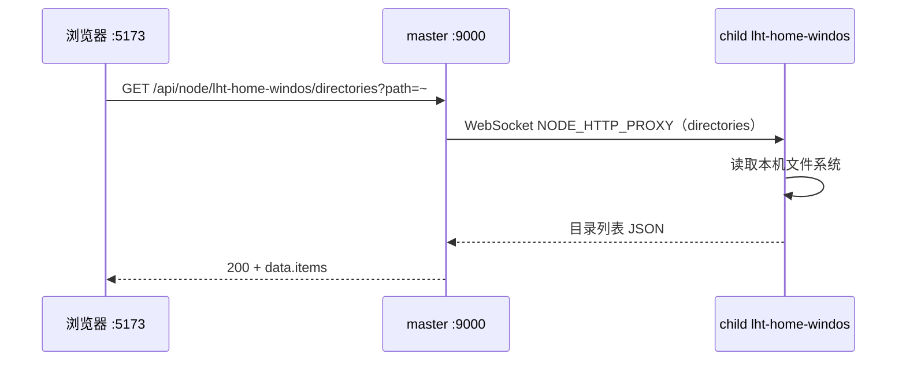

**节点 online** 只说明 child 与 master 的 WebSocket 长连接正常；**目录浏览** 还要走上述 HTTP 代理。任一步失败都会触发你看到的 alert。

#### 3. 常见原因（按概率）

| 原因 | 说明 |
|------|------|
| **master → child 代理瞬时失败** | child 刚重启、网络抖动、WebSocket 重连中；界面仍显示 online |
| **502 / 代理异常** | master 返回 `{"error": "Node HTTP proxy failed"}` 等扁平 JSON → 前端显示「未知错误」 |
| **路径无效** | 浏览了不存在或无权限的路径（较少见，通常会有具体 message） |
| **Token 过期** | 401 时 body 为 `detail.message`，前端同样解析不到 → 「未知错误」 |

#### 4. 本机验证（child 本身能力正常）

在本机 child Gateway（`127.0.0.1:8000`）上实测，目录 API **可正常工作**：

```bash
# 登录拿 token 后
curl -H "Authorization: Bearer <token>" \
  "http://127.0.0.1:8000/api/node/lht-home-windos/directories?path=/mnt/d/code_pub/Jarvis"
# → success: true，能列出子目录
```

说明 **本机 child 读盘没问题**；问题出在 **远程 master 转发** 或 **浏览器到 master** 这一段。

#### 5. 立即可用的绕过办法

**不必依赖目录选择器**，在工作目录输入框 **手工填写本机 WSL 绝对路径**，例如：

```text
/mnt/d/code_pub/Jarvis
```

然后直接点「创建」即可（配合 **代码 Agent**）。

#### 6. 排查步骤

1. **浏览器 F12 → Network**，找到 `directories?path=` 请求，看 **Status** 和 **Response** 原文（比「未知错误」准确）。
2. **本机看 child 日志**：`tail -f ~/.jarvis/child-service.log`（心跳 `Could not find system disk partition` 表示 child 已连上 master）。
3. **确认 child 在线**：`pgrep -af "jarvis-service run.*lht-home-windos"`。
4. 若 502 / 代理失败：**重启 child**（`~/.jarvis/stop-child-node.sh && ~/.jarvis/start-child-node.sh`），等 master 显示 online 后再试。
5. 若 401：在 Web 界面 **重新连接** `jvs-ai.cn:9000` 并登录。

#### 一句话

> **online ≠ 目录代理一定成功。** 这是 master 经 WebSocket 向 child 要目录列表时失败；可先 **手工填工作目录** 创建 Agent，并用 F12 看 `directories` 接口的真实报错。

---

## 附录

### 附录 A · 2026-06-10

> 原编号：Q4（文档约定）

**问题**：从现在开始问的所有问题，都记录到 `lihuating_problem.md` 文件中。

**答复**：已确认。后续每次提问都会追加到本文件对应章节，包含问题原文与简要答复/结论。

---

## 相关文档

- [Web Gateway 架构依赖与使用指南](docs/用户手册/04_web_界面与网关/Web_Gateway_架构依赖与使用指南.md)
- 根目录快捷方式：[Web_Gateway_架构依赖与使用指南.md](Web_Gateway_架构依赖与使用指南.md)

---
